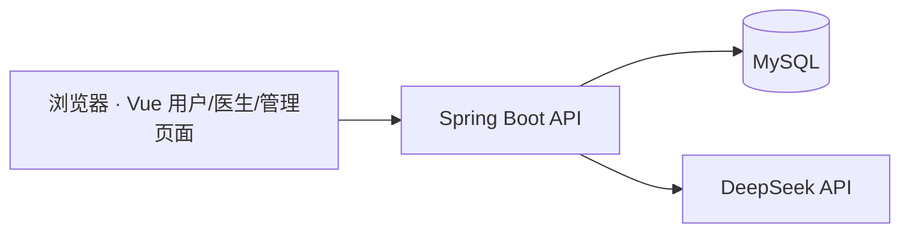

<div align="center">
  <h1>IHMS · 智慧健康管理系统</h1>
  <p><strong>面向用户、医生和管理员的健康信息管理 Web 应用</strong></p>
  <p>记录健康指标、阅读健康资讯、发起医生咨询，并通过管理后台维护平台内容。</p>
  <p>
    
    
    
    
    <br />
    
  </p>
</div>

> 本项目用于学习和演示。健康分析与 AI 回复不能替代医生诊断、处方或紧急医疗服务。

## ✨ 项目简介

IHMS 由 Vue 前端、Spring Boot 后端和 MySQL 数据库组成。前端包含用户端、医生端和管理端页面，后端提供健康记录、资讯、咨询消息及 AI 咨询等接口。仓库中的 SQL 文件包含演示记录，适合在**独立的本地测试数据库**中导入。

## 🖼️ 界面预览

| 用户首页 | 健康数据 |
| --- | --- |
|  |  |

| 医生咨询 | 管理后台 |
| --- | --- |
|  |  |

## 🚀 核心功能

- **个人健康记录**：录入和查看健康指标，展示趋势及异常指标提醒。
- **健康资讯**：浏览、搜索、收藏资讯，支持评论与分类管理。
- **医生咨询**：用户创建咨询并发送消息，医生查看和回复会话；当前前端聊天使用 HTTP 轮询。
- **管理后台**：维护用户、医生、资讯、消息、健康记录及健康模型配置。
- **AI 辅助**：后端提供 DeepSeek 聊天、健康建议和健康分析相关接口；调用外部模型需要单独配置 API Key，效果依赖模型服务。

## 🧩 技术栈

| 模块 | 技术 |
| --- | --- |
| 前端 | Vue 2、Vue Router、Element UI、Axios、ECharts |
| 后端 | Java 8、Spring Boot 2.6.13、MyBatis、MyBatis-Plus |
| 数据库 | MySQL；仓库 SQL 导出自 MySQL 8.0 |
| 接口与鉴权 | Knife4j / Swagger、JWT 拦截器 |
| AI | DeepSeek API 及后端健康分析服务 |

## 🏗️ 系统架构



前端开发服务默认运行在 `http://localhost:21091`，后端默认运行在 `http://localhost:21090`。Axios 在 `IHMS-view/src/utils/request.js` 中使用固定的后端地址，API 前缀为 `/api/personal-heath/v1.0`。这里的 `heath` 是现有配置中的拼写，修改时须同步调整前后端。

## 📁 项目结构

```text
IHMS/
├── IHMS-admin/                  # Spring Boot 后端
│   └── src/main/
│       ├── java/com/star/      # Controller、Service、Mapper 等
│       └── resources/          # application.yml、Mapper XML、预览图片
├── IHMS-view/                   # Vue 前端
│   ├── src/views/              # 用户、医生、管理员页面
│   ├── src/router/              # 页面路由
│   └── src/utils/               # HTTP 请求与聊天轮询等
├── sql/personal_health.sql      # 表结构与演示数据
├── LICENSE
└── README.md
```

## ⚡ 快速开始

### 1. 准备环境

- JDK 8 及 Maven 3.6+（后端以 Java 8 为编译目标）。
- MySQL 8.0；仓库中的 SQL 从 MySQL 8.0.39 导出。
- Node.js 16 与 npm；前端基于 Vue CLI 4，较新 Node.js 可使用兼容脚本。

### 2. 初始化数据库

在仓库根目录执行：

```bash
mysql -u root -p -e "CREATE DATABASE IF NOT EXISTS personal_health CHARACTER SET utf8mb4;"
mysql -u root -p personal_health < sql/personal_health.sql
```

Windows PowerShell 不支持上面的输入重定向语法，可在 `cmd.exe` 中执行第二行，或运行：

```powershell
cmd /c "mysql -u root -p personal_health < sql\personal_health.sql"
```

导入脚本包含演示用户、医生、咨询和健康记录。请勿导入已有业务数据的数据库，也不要把这些演示账号用于真实环境。

### 3. 启动后端

编辑 `IHMS-admin/src/main/resources/application.yml`，将 MySQL 连接参数改为本机配置；需要使用 AI 咨询时，再配置 `deepseek.api-key`。该文件由 Git 跟踪，**不要提交真实密码或 API Key**。

```bash
cd IHMS-admin
mvn spring-boot:run
```

也可在 IDE 中运行 `com.star.Application`。后端地址为 `http://localhost:21090/api/personal-heath/v1.0`，Knife4j 页面位于 `http://localhost:21090/api/personal-heath/v1.0/doc.html`（需服务成功启动）。

### 4. 启动前端

在另一个终端执行：

```bash
cd IHMS-view
npm ci
npm run dev
```

浏览器访问 `http://localhost:21091`。若 Node.js 17+ 遇到 OpenSSL 相关构建错误，可使用 `npm run dev:compatible`。前端请求地址写在 `IHMS-view/src/utils/request.js`；变更后端端口或 API 前缀时，需要同步修改它。

## 🔌 主要接口

以下路径都位于 `/api/personal-heath/v1.0` 前缀下；具体参数和鉴权要求以运行中的 Knife4j 页面及 Controller 为准。

| 功能 | 示例路径 |
| --- | --- |
| 登录与注册 | `POST /user/login`、`POST /user/register` |
| 用户健康记录 | `/user-health/*`、`/health/record/*` |
| 健康资讯 | `/news/*`、`/news-save/*` |
| 医生咨询 | `/consultation/*`、`/doctor-message/*` |
| AI 咨询 | `POST /api/deepseek/chat` |

## 🛠️ 开发检查

```bash
cd IHMS-admin
mvn test
```

```bash
cd IHMS-view
npm run lint
npm run build
```

当前仓库没有后端 `src/test` 测试目录；`mvn test` 主要检查编译与现有测试配置。前端生产构建在较新 Node.js 上如遇 OpenSSL 错误，可使用 `npm run build:compatible`。

## 📄 开源许可证

本项目原创代码与文档按 [MIT License](LICENSE) 发布。第三方依赖及仓库中的图片等素材如有各自的权利归属，仍遵循其原有许可；本许可证不授予项目维护者无权授予的权利。
